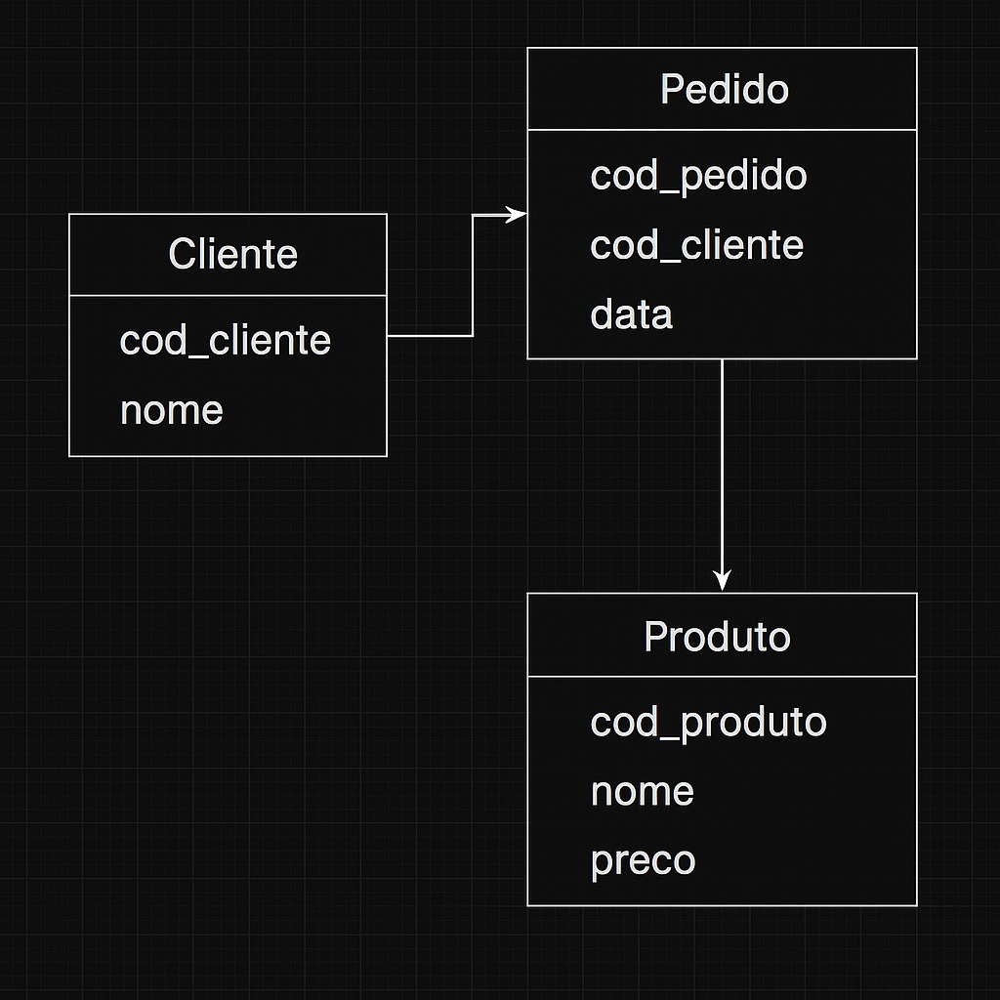

# 🔥 Spark com Iceberg e Delta Lake

Este projeto demonstra a integração de **Apache Spark** com os formatos de tabela **Apache Iceberg** e **Delta Lake**, utilizando **Jupyter Lab** para manipulação de dados com **PySpark** em um ambiente interativo.

## 📦 Tecnologias Utilizadas

- Apache Spark
- Delta Lake
- Apache Iceberg
- Python
- Jupyter Lab
- [uv](https://github.com/astral-sh/uv) (gerenciador de dependências)

---


Foram utilizados os mesmos modelos ER para o Iceberg e para o Delta-Lake

## ⚙️ Configuração do Ambiente ICEBERG

```bash copy
uv init
uv venv
source .venv/bin/activate - LINUX
.venv/scripts/activate - WINDOWS
uv add pyspark==3.5.3 jupyterlab ipykernel
```

**Nota:** Selecionar o seu ambiente virtual (.venv) como Kernel do seu jupyter notebook igual mostrado na imagem abaixo.


Arquivo de INSERT, UPDATE, DELETE E SELECT para as tabelas Iceberg `spark-iceberg.ipynb`.

## ⚙️ Configuração do Ambiente DELTA-LAKE

```bash copy
uv init
uv venv
source .venv/bin/activate - LINUX
.venv/scripts/activate - WINDOWS
uv add pyspark==3.5.3 jupyterlab ipykernel
```

**Nota:** Selecionar o seu ambiente virtual (.venv) como Kernel do seu jupyter notebook, assim como mostrado na imagem abaixo.


Arquivo de INSERT, UPDATE, DELETE E SELECT para as tabelas Delta `spark-delta-lake.ipynb`.
